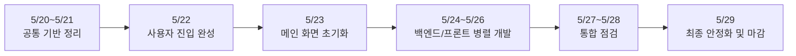

# 팀 통합 마일스톤

## 문서 목적

이 문서는 백엔드와 프론트엔드의 개별 마일스톤 문서를 하나로 합쳐,
5월 20일부터 5월 29일까지 팀 전체가 무엇을 언제 끝내야 하는지 한눈에 볼 수 있도록 정리한 운영 문서입니다.

비개발자도 이해할 수 있도록 기술 용어는 최소화하고,
"언제", "무엇을", "왜" 하는지 중심으로 작성했습니다.

## 일정 범위

- 시작일: 2026년 5월 20일
- 마감일: 2026년 5월 29일
- 목표: 로그인부터 방 생성, 대기, 게임 시작, 플레이, 결과 확인까지 한 번에 이어지는 MVP 흐름 완성

## 한눈에 보는 전체 흐름

## 핵심 운영 원칙

- 초반 4일은 공통 기준을 먼저 맞춥니다.
- 공통 기준이 정리되기 전에는 병렬 작업을 크게 벌리지 않습니다.
- 5월 24일부터는 백엔드와 프론트엔드가 역할을 나눠 동시에 진행합니다.
- 게임 시작은 "버튼을 눌렀다"가 아니라 "실제로 게임 시작 신호를 받았다"를 기준으로 판단합니다.
- AI는 보조 역할만 하며, 실제 상태 변경은 서버가 최종 판단합니다.

## 작업자 구성

- 임현:
  - 로그인, 회원가입, `/main`, AI 채팅, 대기방 흐름 담당
- 박성민:
  - 플레이 화면, 실시간 연결, 결과 화면 담당
- 심정화:
  - 인증, AI 채팅, AI 명령 해석 담당
- 유현하:
  - 방, 참가자, 미션, 게임 시작 준비 담당
- 이수현:
  - 실시간 연결, 실행 파이프, 턴 진행 처리 담당

위 역할은 일정 관리 기준이며, 통합 구간에서는 서로 리뷰와 지원이 필요합니다.

## 팀 마일스톤 요약

| 마일스톤 | 기간 | 목표 | 비개발자 관점 완료 기준 |
|---|---|---|---|
| M1. 공통 기반 정리 | 5/20 ~ 5/21 | 팀이 같은 규칙으로 개발할 수 있는 기본 틀 완성 | 화면, 서버, 데이터 규칙이 서로 충돌하지 않음 |
| M2. 사용자 진입 완성 | 5/22 | 회원가입, 로그인, 기본 접근 제어 완성 | 사용자가 정상적으로 가입하고 로그인할 수 있음 |
| M3. 메인 화면 초기화 | 5/23 | 사용자가 들어왔을 때 현재 상태를 복원하는 메인 화면 완성 | 현재 참여 중인 방, 초대 상태, 대화 맥락이 보임 |
| M4. 병렬 핵심 개발 | 5/24 ~ 5/26 | 방/대기방/AI 흐름과 게임 플레이 흐름을 동시에 구현 | 방을 만들고, 참가하고, 플레이 화면 준비가 각각 독립적으로 동작함 |
| M5. 통합 점검 | 5/27 ~ 5/28 | 각 기능을 하나의 사용자 흐름으로 연결 | 메인 화면에서 시작한 행동이 실제 플레이와 결과 화면까지 이어짐 |
| M6. 최종 안정화 | 5/29 | 오류, 예외, 끊김을 줄이고 마감 기준 충족 | 데모 가능한 수준으로 핵심 흐름이 안정화됨 |

## 날짜별 상세 일정

| 날짜 | 팀 목표 | 백엔드 작업자 | 프론트엔드 작업자 | 산출물 |
|---|---|---|---|---|
| 5/20(수) | 공통 구조 시작 | BE 1~3: 서버 기본 구조, 공통 응답 규칙, 에러 규칙 정리 | FE 1~2: 앱 기본 구조, 라우트, 전역 설정 정리 | 개발 시작이 가능한 공통 뼈대 |
| 5/21(목) | 공통 계약 고정 | BE 1~3: 데이터 규칙, 상태값, 이벤트 이름 확정 | FE 1~2: 타입, API 연결 방식, 공통 에러 처리 확정 | 팀 공통 계약 문서와 구현 기준 |
| 5/22(금) | 사용자 진입 완성 | BE 1: 회원가입, 로그인, 토큰 처리 BE 2~3: 인증 연동 검토와 후속 병렬 작업 준비 | FE 1: 로그인/회원가입 화면, 보호 라우팅 FE 2: 플레이 공통 레이아웃과 상태 진입 준비 | 사용자가 서비스에 안전하게 들어오는 흐름 |
| 5/23(토) | 메인 화면 초기화 | BE 1: AI 채팅 초기 데이터 제공 BE 2: 현재 방, 초대 목록 API 정리 BE 3: 실시간 연결 진입 조건 점검 | FE 1: `/main`에서 현재 상태 복원 FE 2: 플레이/결과 화면 진입 구조 준비 | 병렬 개발을 시작할 공통 출발점 |
| 5/24(일) | 병렬 개발 1일차 | BE 1: AI 명령 처리 고도화 BE 2: 방 생성, 초대, 참가, 대기방 상태 처리 BE 3: 실시간 연결 기반 준비 | FE 1: `/main`에서 방 생성/초대/대기방 UI 구현 FE 2: 플레이 화면 뼈대와 실시간 연결 시작 | 로비 흐름의 기본 동작 |
| 5/25(월) | 병렬 개발 2일차 | BE 1: AI 후속 메시지와 로비 연결 준비 BE 2: 게임 시작 준비, 미션 상태 정리 BE 3: 플레이 상태 전환, 실행 파이프 구축 | FE 1: 게임 시작 요청 후 대기 UX 구현 FE 2: 플레이 화면, 실시간 연결, 게임 시작 진입 구현 | 실제 게임 진입 준비 |
| 5/26(화) | 병렬 개발 3일차 | BE 1: AI 명령 예외 처리 점검 BE 2: 힌트/미션 상태 연결 BE 3: 턴 진행, 제출, 결과 기록 처리 | FE 1: `/main` 예외 상태와 초대 처리 마무리 FE 2: 타이머, 코드 편집, 제출, 결과 반영 구현 | 플레이 흐름의 핵심 기능 |
| 5/27(수) | 통합 점검 1일차 | BE 1+2: AI 명령과 방 상태 연결 BE 2+3: 게임 시작 검증 | FE 1+2: 메인 화면과 플레이 화면 이동 연결 | 방 생성부터 시작까지 단일 흐름 연결 |
| 5/28(목) | 통합 점검 2일차 | BE 2+3: 턴 종료, 미션 완료, 결과 이벤트 정리 BE 1: 메시지/안내 흐름 정리 | FE 1: 대기 및 예외 상태 UX 정리 FE 2: 결과 화면, 재진입 UX 정리 | 플레이부터 결과까지 연결 완료 |
| 5/29(금) | 최종 안정화 | BE 1~3: 권한, 중복 요청, 재연결, 타임아웃 검증 | FE 1~2: 끊김 없는 사용자 흐름 확인, 오류 문구 정리 | 최종 데모 가능 상태 |

## 작업 흐름별 역할 정리

### 1. 공통 선행 구간: 5/20 ~ 5/23

이 구간은 전체 일정의 기반입니다.
이 시점이 흔들리면 이후 병렬 작업 속도가 크게 떨어집니다.

- 백엔드:
  - BE 1: 로그인/인증, AI 채팅 기준 정리
  - BE 2: 방, 참가자, 미션 데이터 기준 정리
  - BE 3: 실시간 이벤트와 실행 흐름 기준 정리
- 프론트엔드:
  - FE 1: 로그인과 `/main` 중심 화면 구조 정리
  - FE 2: 플레이/결과 화면 구조와 실시간 진입 구조 정리
  - FE 1~2: 서버와 통신하는 공통 방식 정리
- 팀 리더 체크포인트:
  - 팀이 같은 용어와 상태값을 쓰고 있는가
  - 메인 화면(`/main`)이 병렬 작업의 공통 출발점이 되었는가

### 2. 병렬 개발 구간: 5/24 ~ 5/26

이 구간부터는 두 흐름을 동시에 진행합니다.

- 트랙 A. 로비/대기방 흐름
  - 담당: FE 1, BE 1, BE 2
  - AI와 대화하며 방 만들기
  - 초대 보내기, 수락/거절 처리
  - 대기방에서 참가자 상태 확인
  - 방장이 게임 시작 요청
- 트랙 B. 게임 플레이 흐름
  - 담당: FE 2, BE 3
  - 실시간 접속
  - 게임 시작 신호 수신
  - 코드 편집과 턴 진행
  - 결과 반영과 다음 단계 이동

팀 리더는 이 시점에 아래 두 가지를 계속 확인해야 합니다.

- 방 시작 버튼을 눌렀다고 바로 플레이 화면으로 넘기지 않는지
- 서버 상태와 화면 상태가 따로 놀지 않는지

### 3. 통합 및 안정화 구간: 5/27 ~ 5/29

이 구간의 목표는 "기능이 있다"가 아니라 "하나의 경험으로 이어진다"를 확인하는 것입니다.

- 통합 중점:
  - 담당: FE 1~2, BE 1~3 전원
  - AI 명령이 실제 방 상태와 맞물리는지 확인
  - 메인 화면에서 시작한 흐름이 플레이와 결과까지 끊기지 않는지 확인
  - 실시간 이벤트가 화면 이동 기준으로 정확히 쓰이는지 확인
- 안정화 중점:
  - 담당: FE 1~2, BE 1~3 전원
  - 중복 클릭이나 중복 요청이 문제를 만들지 않는지 확인
  - 접속이 잠시 끊겼을 때 다시 진입 가능한지 확인
  - 시간 초과나 실패 상황에서 사용자 안내가 자연스러운지 확인

## 작업자별 책임 요약

| 작업자 | 핵심 책임 | 집중 구간 | 통합 시 반드시 확인할 것 |
|---|---|---|---|
| FE 1 | 로그인, `/main`, AI 채팅, 초대, 대기방 | 5/22 ~ 5/28 | 게임 시작 요청 후 실제 시작 신호 전까지의 사용자 경험 |
| FE 2 | 플레이 화면, 실시간 연결, 결과 화면 | 5/23 ~ 5/29 | `game-started`와 `mission-result` 수신 시 화면 전환 정확성 |
| BE 1 | 인증, AI 채팅, AI 명령 해석 | 5/20 ~ 5/28 | AI가 잘못 해석해도 서버 상태가 잘못 바뀌지 않는지 |
| BE 2 | 방, 참가자, 미션, 게임 시작 준비 | 5/20 ~ 5/29 | 방 상태와 참가자 권한이 모든 흐름에서 일관적인지 |
| BE 3 | 실시간 연결, 실행 파이프, 턴 진행 | 5/20 ~ 5/29 | 실시간 이벤트와 실제 게임 상태가 어긋나지 않는지 |

## 최종 완료 기준

5월 29일 마감 시점에는 아래가 가능해야 합니다.

1. 사용자가 회원가입과 로그인을 할 수 있다.
2. 메인 화면에서 현재 방 상태와 초대 상태를 확인할 수 있다.
3. AI 또는 일반 UI를 통해 방 생성과 참가 흐름이 이어진다.
4. 대기방에서 게임 시작 준비와 시작 요청이 가능하다.
5. 실제 게임 시작 신호를 받은 뒤 플레이 화면으로 자연스럽게 이동한다.
6. 플레이 중 턴 진행, 제출, 결과 반영이 이어진다.
7. 최종 결과 화면까지 흐름이 끊기지 않는다.

## 주요 리스크와 대응

| 리스크 | 영향 | 대응 방식 |
|---|---|---|
| 초반 공통 규칙이 늦게 정리됨 | 전체 일정 지연 | 5/21 안에 상태값, 이벤트명, 공통 응답 형식을 고정 |
| 백엔드와 프론트엔드가 다른 기준으로 게임 시작을 판단함 | 화면 이동 오류 | `game-started` 같은 실제 시작 신호를 공통 기준으로 사용 |
| AI가 잘못 이해한 내용을 그대로 상태에 반영함 | 사용자 혼란 | AI는 해석만 하고, 실제 반영은 서버 검증 후 처리 |
| 병렬 개발 중 공통 데이터 구조가 자주 바뀜 | 재작업 증가 | 5/23까지 `/main` 기준 데이터 구조를 사실상 확정 |
| 막판에 재연결, 타임아웃, 중복 요청 문제가 드러남 | 데모 실패 위험 | 5/29를 안정화 전용 날짜로 확보 |

## 리더용 주간 체크 질문

- 5/21 종료 시점:
  - 팀이 공통 용어와 상태 기준을 합의했는가
- 5/23 종료 시점:
  - `/main`이 실제 병렬 개발 출발점 역할을 하는가
- 5/26 종료 시점:
  - 로비 흐름과 플레이 흐름이 각각 독립적으로 동작하는가
- 5/28 종료 시점:
  - "로그인 → 방 생성/참가 → 대기 → 게임 시작 → 플레이 → 결과"가 하나로 이어지는가
- 5/29 종료 시점:
  - 데모 중 끊길 가능성이 높은 예외 상황까지 최소한 방어했는가
